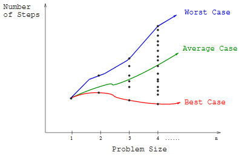
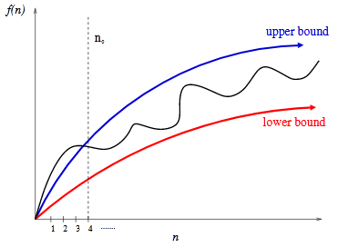
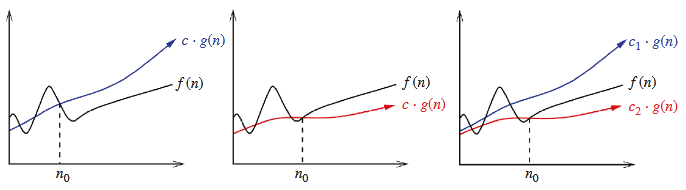

# Proof by Induction
* Induction and recursion are similiar.
* Recursion is the mathematical induction in action.
* In both, we have general and boundary conditions, with the general condition breaking the problem into smaller and smaller pieces. The initial or boundary condition terminates the recursion.
* Induction is used to prove incremental or recursive algorithms.

## Real Life Example
Suppose, we line up a large group of people, and hand each of them a piece of paper and a pen. The first person in line (on the far left) will write a number on their paper, and each person will look at their neighbor on the left and copy what their neighbor wrote on the paper. If we glance at what the first person wrote, and his paper says `27`, then intuitively we know that every person has `27` written on their paper (assuming that every person followed the rule faithfully). If you were to explain why you know that is true, you might say something along the lines of "Well, the first person wrote `27` on their paper, and every other person copied the person on their left." That is just your two conditions! We can see how if you took either of them away, we can't say anything about some arbitrary person in the line.

We can make this more complicated by changing the "rule". If instead the rule is that each person adds `1` to what the person on their left had, then intuitively you can see that a person in position `i` in the line will have `whatever the first person had + (i-1)`.

## Example 
**Problem:** Prove the correctness of the following recursive algorithm for incrementing natural numbers, that is, `y -> y + 1`

```
Increment(y)
    if (y = 0) then return 1
    else if (y mod 2) = 1 then return Increment(floor(y/2))
         else return y + 1
```

**Solution:** 

**Basis Case**: Basis case is of `y = 0`, which is correctly handled as it returns `1` and `0 + 1 = 1`.

**Inductive Hypothesis:** Now assume that the algorithm is correct for some number `n - 1`, that is for `y = n - 1` we get correct result. And because this algorithm is recursive, we can safely assume that it works correctly for all the natural values from `1` to `n - 1` i.e for `y <= n - 1`. Now we must proove that it also works for `y = n`.

The case for even number is handled correctly because `y + 1` is explicitly returned.

For odd numbers (i.e the case where `y mod 2 = 1`), the answer depends on what `Increment(floor(y/2))` returns. Here we use our inductive hypothesis.

Now for odd `y`, we can assume `y = 2m + 1` for some natural integer `m`.

Therefore,
```
Increment(y) = 
2 * Increment(Floor(y/2)) = 2 * Increment(Floor((2m + 1)/2))
                          = 2 * Increment(Floor(m + 1/2))
                          = 2 * Increment(m)
                          = 2 * (m + 1)
                          = 2m + 2
Increment(y)              = y + 1
```
**Conclusion:** As for even and odd integer `y`, `Increment(y)` results in `y + 1`, and for basis case of `y = 0` gives correct answer `1`, it is proved that the algorithm works correctly for any natural integer.

# Modelling the Problem using Combinatorial Objects
Real world problems include real objects. For example, suppose we want to write an algorithm for car parking system, this problem include real cars, but we cannot include real cars in our algorithm, we include something that represents a car. In most cases algorithms have to work on a collection of objects, so we have to generalise the collection of objects in one of the following: 
* **Permutations** are arrangements, or orderings, of items. For example, { 1, 4, 3, 2 } and { 4, 3, 2, 1 } are two distinct permutations of the same set of four integers. Permutations are likely the object in question whenever our problem seeks an "arrangement", "tour", "ordering", or "sequence".
* **Subsets** represent selections from a set of items. For example, { 1, 3, 4 } and { 2 } are two distinct subsets of the first four integers. Order does not matter in subsets the way it does with permutations, so the subsets { 1, 3, 4 } and { 4, 3, 1 } would be considered identical. They are likely the object in question whenever your problem seeks a "cluster", "collection", "committee", "group", "packaging", or "selection".
* **Trees** represent hierarchical relationships between items. Trees are likely the object in question whenever your problem seeks a "hierarchy", "dominance relationship", "ancestor/descendant relationship", or "taxonomy".
* **Graphs** represent relationships between arbitrary pairs of objects. For example, a network of roads as a graph, where the vertices are cities and the edges are roads connecting pairs of cities. Graphs are likely the object in question whenever you seek a "network", "circuit", "web", or "relationship".
* **Points** define locations in some geometric space. For example, the locations of McDonald’s restaurants can be described by points on a map/plane. Points are likely the object in question whenever your problems work on "sites", "positions", "data records", or "locations".
* **Polygons** define regions in some geometric spaces. For example, the borders of a country can be described by a polygon on a map/plane. Polygons and polyhedra are likely the object in question whenever you are working on "shapes", "regions", "configurations", or "boundaries".
* **Strings** represent sequences of characters, or patterns. For example, the names of students in a class can be represented by strings. Strings are likely the object in question whenever you are dealing with "text", "characters", "patterns", or "labels".

**The structures given above are recursive structures, for example, if we remove the first element from a permutation, we get a permutation of remaining elements. Learning to think recursive about these structures is learning to break a big problem into small instances of same kind.**

**Modeling your application in terms of well-defined structures and algorithms is the most important single step towards a solution.**


## Interview Questions
1. **Problem:** Write a function to perform integer division without using either the `/` or `*` operators.

    **Solution:** The key observation is that the quotient of a division is just the number of times that we can subtract the divisor from the dividend without making it negative.

    Here we are increasing the value of divisor using **left shift by 1** (equivalent to **multiply by 2**) until it is greater than or equal to dividend. For example, consider `dividend = 15` and `divisor = 5`, we are increasing divisor `5` using `left shift by 1` until it can be safely substracted from dividend `15`. In this case `5 << 1 = 10`,
    can safely be substracted from `15`. That means we are shifting one time, but since we are "shifting", we also have to shift the number of "shifting" which becomes `2`. Now we substract `10` from `15`, `15 - 10 = 5`, this is the new dividend. Now we apply same method to divide new dividend `5` by the divisor `5`, which gives `1`. Now we add this result to previous result.

    **Psuedocode:**
    ```
    DIVIDE_USING_SHIFT_OPERATOR(dividend, divisor) 
        1. Handle base cases like divide by 0, and divide by 1 etc
        2. Set quotient = 1 and temp = divisor
        3. Repeat while (temp << 1) <= dividend 
                a. temp = temp << 1
                b. quotient = quotient << 1
        4. quotient = quotient + DIVIDE_USING_SHIFT_OPERATOR((dividend - temp), divisor);
        5. Return quotient;
    ```

    **Programm Link:** https://github.com/VedantWankhade/coding-problems/blob/master/division_without_mul_div_operator.cpp

2. **Problem:** There are twenty-five horses. At most, five horses can race together at a time. You must determine the fastest, second fastest, and third fastest horses. Find the minimum number of races in which this can be done.

**Answer:** 7 races

**Solution:** We have 25 horses, lets arrange them in a 5x5 matrix. Where each row will represent a race.

                       1       2       3       4       5
    Race 1 ->    1   [1,1]   [1,2]   [1,3]   [1,4]   [1,5]
    Race 2 ->    2   [2,1]   [2,2]   [2,3]   [2,4]   [2,5]
    Race 3 ->    3   [3,1]   [3,2]   [3,3]   [3,4]   [3,5]
    Race 4 ->    4   [4,1]   [4,2]   [4,3]   [4,4]   [4,5]
    Race 5 ->    5   [5,1]   [5,2]   [5,3]   [5,4]   [5,5]

After these 5 races, we have 5 horses which are the `fastest in there respective row (race)`. If we race these 5 horses in Race 6, the winning horse will be the `fastest among the 25 horses`. Now the `second fastest horse among the 25 horses` could be the `second fastest horse in the race 6` or `second fastest horse in the race 1`. So we have to race these two horses.
The `third fastest horse among 25` could be the `third fastest horse in the race 6` or the `second fastes horse in race 2` or the `third fastest horse in Race 1`. So we have to race these three horses too. And we can race these five ramaining horse in a single race Race 7. 

For example, suppose in first 5 races, the fastest horse are the 5th horses, second fastest are the 4th horses and third fastest are 3rd in row. 

For instance, the fastest horse in Race 1 is [1,5], the second fastest is [1,4] and the third fastest is [1,3].

If we race the fastest horses from each row ([1,5], [2,5], [3,5], [4,5], [5,5]) in Race 6, the winning horse will be the fastest among all 25 horses. 

Race 6 -> [1,5], [2,5], [3,5], [4,5], [5,5]

Let's say the winning horse in Race 6 is [1,5]. So [1,5] is the fastes horse among 25 horses.

                       1       2       3       4       5
    Race 1 ->    1   [1,1]   [1,2]   [1,3]   [1,4]   [1,5] 
    Race 2 ->    2   [2,1]   [2,2]   [2,3]   [2,4]   [2,5]
    Race 3 ->    3   [3,1]   [3,2]   [3,3]   [3,4]   [3,5]
    Race 4 ->    4   [4,1]   [4,2]   [4,3]   [4,4]   [4,5]
    Race 5 ->    5   [5,1]   [5,2]   [5,3]   [5,4]   [5,5]

                                                        ^
                                                        |
                                                      Race 6


Now the `second fastest horse among all 25` could be any runner up horse to [1,5]. The runner up horses to [1,5] are [1,4] (second fastest horse from Race 1) and [2,5] (second fastest horse in Race 6).
So we have to race these two horses.
And the `third fastest among all 25` could be any runner up horse to [1,5] and [2,5] (second fastes in Race 6) and second runner up to [1,5]. So we have to race these horses too.

We can race these remaining horses in Race 7. 

Race 7 -> [1,4], [2,5], [1,3], [2,4], [3,5]

The `fastest in Race 7` will be the `second fastest among 25` and the `second fastest in Race 7` will be the `third fastest among 25`.

3. **Problem:** Prove that a tree with `n` vertices has `n - 1` edges.
   
   **Solution:** Basis case for `n = 1` is correct as it should have `0` edges, and `1 - 1 = 0`.

    Let `v(n)` be the number of vertices for `n` nodes(vertices) and `e(n)` be the number of edges.

    Inductive step: Consider the condition to be true for `n = k`, i.e `v(k) = k` and `e(k) = k - 1`.

    Now we prove for `n = k + 1`,
        We can say that, 
            `The number of edges for k + 1 nodes is equal to number of edges for k nodes + number of edges required to add k + 1 th node.

            e(k + 1) = e(k) + 1             (as adding on node requires one edge)
            e(k + 1) = v(k) - 1 + 1
            e(k + 1) = v(k)
            e(k + 1) = k
        Hence proved 

## LeetCode

1. **Problem:** https://leetcode.com/problems/daily-temperatures/

   **Solution:** https://github.com/VedantWankhade/coding-problems/blob/master/daily_temperature.cpp

2. **Problem:** https://leetcode.com/problems/rotate-list/
    
    **Solution:** 
    ```
    ROTATE_LIST(head, k)
        1. If list is empty or only has 1 element return lists as it is
        2. Else find length len of the list
        3. Set k = k % len
        4. Repeat k times
            a. 
    ```

# Algorithm Analysis

## The RAM Model of Computation

Machine-independent algorithm design depends upon a hypothetical computercalled theRandom Access Machine, or RAM. Under this model of computation,we are confronted with a computer where:

* Each simple operation (+, *, –, =, if, call) takes exactly one time step.
* Loops and subroutines are not considered simple operations. Instead, they are the composition of many single-step operations.
* Each memory access takes exactly one time step. Furthermore, we have as much memory as we need. The RAM model takes no notice of whether an item is in cache or on the disk.

## Best-Case, Worst-Case, and Average-Case Complexity

To understand the notions of the best, worst, and average-case complexity,think about running an algorithm over all possible instances of data that can befed to it. For the problem of sorting, the set of possible input instances includesevery possible arrangement ofnkeys, for all possible values ofn.  We canrepresent each input instance as a point on a graph (shown in figure below) wherethex-axis represents the size of the input problem (for sorting, the number ofitems to sort), and they-axis denotes the number of steps taken by the algorithmin this instance.



* The worst-case complexity of the algorithm is the function defined by the maximum number of steps taken in any instance of size n. This represents the curve passing through the highest point in each column.
* The best-case complexity of the algorithm is the function defined by the minimum number of steps taken in any instance of size n. This represents the curve passing through the lowest point of each column.
* The average-case complexity or expected time of the algorithm, which is the function defined by the average number of steps over all instances of size n.

## The Big Oh Notation

It proves to be much easier to talk in terms of simple upper and lower boundsof time-complexity functions using the Big Oh notation. The Big Oh simplifiesour analysis by ignoring levels of detail that do not impact our comparison ofalgorithms.The Big Oh notation ignores the difference between multiplicative constants.The functionsf(n)=2nandg(n)=nare identical in Big Oh analysis. Thismakes sense given our application. Suppose a given algorithm in (say) C lan-guage ran twice as fast as one with the same algorithm written in Java. Thismultiplicative factor of two can tell us nothing about the algorithm itself, be-cause both programs implement exactly the same algorithm. We should ignoresuch constant factors when comparing two algorithms.





* f(n)=O(g(n)) means c·g(n) is an upper bound on f(n). Thus, there exists some constant c such that f(n)≤c·g(n) for every large enough n (that is, for all n ≥ n0, for some constant n0).
* f(n)=Ω(g(n)) means c·g(n) is a lower bound on f(n). Thus, there exists some constant c such that f(n)≥c·g(n) for all n ≥ n0. 
* f(n)=Θ(g(n)) means c1·g(n) is an upper bound on f(n) and c2·g(n) is a lower bound on f(n), for all n≥n0. Thus, there exist constants c1 and c2 such that f(n)≤c1·g(n) and f(n)≥c2·g(n) for all n≥n0. This means that g(n) provides a nice, tight bound on f(n).

## Dominance Relation

The Big Oh notation groups functions into a set of classes, such that all the functions within a particular class are essentially equivalent. Functions f(n)=0.34n and g(n) = 234234n belong in the same class, namely those that are order Θ(n). Furthermore, when two functions f and g belong to different classes, they are different with respect to our notation, meaning either f(n)=O(g(n)) or g(n)=O(f(n)), but not both. 

We say that a faster growing function dominates a slower growing one. When f and g belong to different classes (i.e.f(n)=Θ(g(n))), we say g dominates f when f(n)=O(g(n)). This is sometimes written g >> f.

* `Constant functions`, f(n) = 1: Such functions might measure the cost of adding two numbers, printing out “The Star Spangled Banner,” or the growth realized by functions such as f(n) = min(n,100). In the big picture, there is no dependence on the parameter n.
* `Logarithmic functions`, f(n) = logn: Logarithmic time complexity shows up in algorithms such as binary search. Such functions grow quite slowly as n gets big, but faster than the constant function (which is standing still, after all). 
* `Linear functions`, f(n)=n: Such functions measure the cost of looking at each item once (or twice, or ten times) in an n element array, say to identify the biggest item, the smallest item, or compute the average value.
* `Superlinear functions/Linearrithmic functions`, f(n)=n lgn: This important class of functions arises in such algorithms as quicksort and mergesort. They grow just a little faster than linear), but enough so to rise to a higher dominance class.
* `Quadratic functions`, f(n)=npow(2): Such functions measure the cost of looking at most or all pairs of items in an n-element universe. These arise in algorithms such as insertion sort and selection sort.
* `Cubic functions`, f(n)=n3: Such functions enumerate all triples of items in an n-element universe. These also arise in certain dynamic programming algorithms.
* `Exponential functions`, f(n)=cn for a given constant c>1: Functions like 2n arise when enumerating all subsets of n items. As we have seen, exponential algorithms become useless fast, but not as fast as. . .
* `Factorial functions`, f(n)=n!: Functions like n! arise when generating all permutations or orderings of n items.

    n! >> 2<sup>n</sup> >> n<sup>3</sup> >> n<sup>2</sup> >> nlogn >> n >> logn >> 1

## Reasoning about Efficiency

**Example 1:** Selection sort

Main logic of selection sort is 

```C
for (i =0;i<n; i++) {
    min = i;
    for (j = i +1;j < n; j++) {
        if (s[j]< s[min]) {
            min = j;
        }
    }
    swap(&s[i],&s[min]);
```

The outer for loop goes around `n` times. The nested inner loop goes around `n−(i+ 1)` times, where `i` is the index of the outer loop. The exact number of times the if statement is executed is given by:

$$
T(n) \quad= \quad\sum_{i = 0}^{n - 1} \sum_{j = i + 1}^{n - 1} 1\\
     = \sum_{i = 0}^{n - 1} {n - 1 - i}
$$
As i goes from 0 to n - 1, j goes from j = 1 to n - 1 hence the sum is n - 1 - i

If we try putting each value of i, we get

$$
\sum_{i = 0}^{n - 1} {n - 1 - i} = (n - 1 - 0) + (n - 1 - 1) + (n - 1 - 2) + .... + (n - 1 - (n - 2)) + (n - 1 - (n - 1))\\
                                 = (n - 1) + (n - 2) + (n - 3) + ...... + 1 + 0\\
                                 = (n - 1)((n - 1) + 1)/2\\
                                 = (n - 1)(n)/2\\
                                 = (n^2 - n)/2\\
                            T(n) = O(n^2)
$$

**Example 2:** Inertion Sort

The main logic of insertion sort is

```C
for (i =1;i < n; i++) {
    j = i; 
    while((j > 0) && (s[j] < s[j -1])) {
        swap(&s[j], &s[j-1]);
        j = j-1;
    }
}
```

How often does the inner while loop iterate? This is tricky because there are two different stopping conditions: one to prevent us from running off the bounds of the array (j>0) and the other to mark when the element finds its proper place in sorted order (s[j] < s[j−1]). Since worst-case analysis seeks an upper bound on the running time, we ignore the early termination and assume that this loop always goes around `i` times.
In fact, we can simplify further and assume it always goes around `n` times since i < n. Since the outer loop goes around `n` times, insertion sort must be a quadratic time algorithm, that is, $O(n^2)$.

### Examples

1. f(n) = 3n2 − 100n + 6 = O(n2), because for c=3, 3n2 > f(n) 
2. f(n) = 3n2 − 100n + 6 = O(n3), because for c=1, n3 > f(n) when n > 3; 
3. f(n) = 3n2 − 100n + 6 = O(n), because for any c > 0, cn < f(n) when n > (c+ 100)/3, since n > (c+ 100)/3 
   
    ⇒ 3n > c + 100 

    ⇒ 3n2 > cn + 100n > cn + 100n − 6 

    ⇒ 3n2 − 100n + 6 = f(n) > cn; 
4. f(n) = 3n2 − 100n + 6 = Ω(n2), because for c = 2, 2n2 < f(n) when n > 100; f(n) = 3n2 − 100n + 6 = Ω(n3), because for any c > 0, f(n) < c·n3 when n > 3/c + 3; 
5. f(n) = 3n2 − 100n + 6 = Ω(n), because for any c > 0, f(n) < 3n2 + 6n2 = 9n2, which is < cn3 when n > max(9/c,1); 
6. f(n) = 3n2 − 100n + 6 = Θ(n2), because both O and Ω apply; f(n) = 3n2 − 100n + 6 = Θ(n3), because only O applies; 
7. f(n) = 3n2 − 100n + 6 = Θ(n), because only Ω applies.

