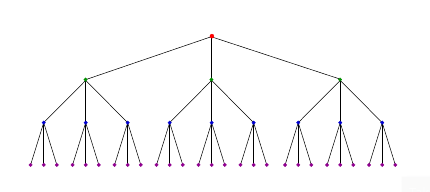

Data Structures and Algorithms 

Reference: The Algorithm Design Manual by Steven Skiena

# Proof by Induction
* Induction and recursion are similiar.
* Recursion is the mathematical induction in action.
* In both, we have general and boundary conditions, with the general condition breaking the problem into smaller and smaller pieces. The initial or boundary condition terminates the recursion.
* Induction is used to prove incremental or recursive algorithms.

## Real Life Example
Suppose, we line up a large group of people, and hand each of them a piece of paper and a pen. The first person in line (on the far left) will write a number on their paper, and each person will look at their neighbor on the left and copy what their neighbor wrote on the paper. If we glance at what the first person wrote, and his paper says `27`, then intuitively we know that every person has `27` written on their paper (assuming that every person followed the rule faithfully). If you were to explain why you know that is true, you might say something along the lines of "Well, the first person wrote `27` on their paper, and every other person copied the person on their left." That is just your two conditions! We can see how if you took either of them away, we can't say anything about some arbitrary person in the line.

We can make this more complicated by changing the "rule". If instead the rule is that each person adds `1` to what the person on their left had, then intuitively you can see that a person in position `i` in the line will have `whatever the first person had + (i-1)`.

## Example 
**Problem:** Prove the correctness of the following recursive algorithm for incrementing natural numbers, that is, `y -> y + 1`

```
Increment(y)
    if (y = 0) then return 1
    else if (y mod 2) = 1 then return Increment(floor(y/2))
         else return y + 1
```

**Solution:** 

**Basis Case**: Basis case is of `y = 0`, which is correctly handled as it returns `1` and `0 + 1 = 1`.

**Inductive Hypothesis:** Now assume that the algorithm is correct for some number `n - 1`, that is for `y = n - 1` we get correct result. And because this algorithm is recursive, we can safely assume that it works correctly for all the natural values from `1` to `n - 1` i.e for `y <= n - 1`. Now we must proove that it also works for `y = n`.

The case for even number is handled correctly because `y + 1` is explicitly returned.

For odd numbers (i.e the case where `y mod 2 = 1`), the answer depends on what `Increment(floor(y/2))` returns. Here we use our inductive hypothesis.

Now for odd `y`, we can assume `y = 2m + 1` for some natural integer `m`.

Therefore,
```
Increment(y) = 
2 * Increment(Floor(y/2)) = 2 * Increment(Floor((2m + 1)/2))
                          = 2 * Increment(Floor(m + 1/2))
                          = 2 * Increment(m)
                          = 2 * (m + 1)
                          = 2m + 2
Increment(y)              = y + 1
```
**Conclusion:** As for even and odd integer `y`, `Increment(y)` results in `y + 1`, and for basis case of `y = 0` gives correct answer `1`, it is proved that the algorithm works correctly for any natural integer.

# Modelling the Problem using Combinatorial Objects
Real world problems include real objects. For example, suppose we want to write an algorithm for car parking system, this problem include real cars, but we cannot include real cars in our algorithm, we include something that represents a car. In most cases algorithms have to work on a collection of objects, so we have to generalise the collection of objects in one of the following: 
* **Permutations** are arrangements, or orderings, of items. For example, { 1, 4, 3, 2 } and { 4, 3, 2, 1 } are two distinct permutations of the same set of four integers. Permutations are likely the object in question whenever our problem seeks an "arrangement", "tour", "ordering", or "sequence".
* **Subsets** represent selections from a set of items. For example, { 1, 3, 4 } and { 2 } are two distinct subsets of the first four integers. Order does not matter in subsets the way it does with permutations, so the subsets { 1, 3, 4 } and { 4, 3, 1 } would be considered identical. They are likely the object in question whenever your problem seeks a "cluster", "collection", "committee", "group", "packaging", or "selection".
* **Trees** represent hierarchical relationships between items. Trees are likely the object in question whenever your problem seeks a "hierarchy", "dominance relationship", "ancestor/descendant relationship", or "taxonomy".
* **Graphs** represent relationships between arbitrary pairs of objects. For example, a network of roads as a graph, where the vertices are cities and the edges are roads connecting pairs of cities. Graphs are likely the object in question whenever you seek a "network", "circuit", "web", or "relationship".
* **Points** define locations in some geometric space. For example, the locations of McDonald’s restaurants can be described by points on a map/plane. Points are likely the object in question whenever your problems work on "sites", "positions", "data records", or "locations".
* **Polygons** define regions in some geometric spaces. For example, the borders of a country can be described by a polygon on a map/plane. Polygons and polyhedra are likely the object in question whenever you are working on "shapes", "regions", "configurations", or "boundaries".
* **Strings** represent sequences of characters, or patterns. For example, the names of students in a class can be represented by strings. Strings are likely the object in question whenever you are dealing with "text", "characters", "patterns", or "labels".

**The structures given above are recursive structures, for example, if we remove the first element from a permutation, we get a permutation of remaining elements. Learning to think recursive about these structures is learning to break a big problem into small instances of same kind.**

**Modeling your application in terms of well-defined structures and algorithms is the most important single step towards a solution.**


## Interview Questions
1. **Problem:** Write a function to perform integer division without using either the `/` or `*` operators.

**Solution:** The key observation is that the quotient of a division is just the number of times that we can subtract the divisor from the dividend without making it negative.

Here we are increasing the value of divisor using **left shift by 1** (equivalent to **multiply by 2**) until it is greater than or equal to dividend. For example, consider `dividend = 15` and `divisor = 5`, we are increasing divisor `5` using `left shift by 1` until it can be safely substracted from dividend `15`. In this case `5 << 1 = 10`,
can safely be substracted from `15`. That means we are shifting one time, but since we are "shifting", we also have to shift the number of "shifting" which becomes `2`. Now we substract `10` from `15`, `15 - 10 = 5`, this is the new dividend. Now we apply same method to divide new dividend `5` by the divisor `5`, which gives `1`. Now we add this result to previous result.

**Psuedocode:**
```
DIVIDE_USING_SHIFT_OPERATOR(dividend, divisor) 
1. Handle base cases like divide by 0, and divide by 1 etc
2. Set quotient = 1 and temp = divisor
3. Repeat while (temp << 1) <= dividend 
        a. temp = temp << 1
        b. quotient = quotient << 1
4. quotient = quotient + DIVIDE_USING_SHIFT_OPERATOR((dividend - temp), divisor);
5. Return quotient;
```

**Programm Link:** https://github.com/VedantWankhade/coding-problems/blob/master/division_without_mul_div_operator.cpp

2. **Problem:** There are twenty-five horses. At most, five horses can race together at a time. You must determine the fastest, second fastest, and third fastest horses. Find the minimum number of races in which this can be done.

**Answer:** 7 races

**Solution:** We have 25 horses, lets arrange them in a 5x5 matrix. Where each row will represent a race.

                       1       2       3       4       5
    Race 1 ->    1   [1,1]   [1,2]   [1,3]   [1,4]   [1,5]
    Race 2 ->    2   [2,1]   [2,2]   [2,3]   [2,4]   [2,5]
    Race 3 ->    3   [3,1]   [3,2]   [3,3]   [3,4]   [3,5]
    Race 4 ->    4   [4,1]   [4,2]   [4,3]   [4,4]   [4,5]
    Race 5 ->    5   [5,1]   [5,2]   [5,3]   [5,4]   [5,5]

After these 5 races, we have 5 horses which are the `fastest in there respective row (race)`. If we race these 5 horses in Race 6, the winning horse will be the `fastest among the 25 horses`. Now the `second fastest horse among the 25 horses` could be the `second fastest horse in the race 6` or `second fastest horse in the race 1`. So we have to race these two horses.
The `third fastest horse among 25` could be the `third fastest horse in the race 6` or the `second fastes horse in race 2` or the `third fastest horse in Race 1`. So we have to race these three horses too. And we can race these five ramaining horse in a single race Race 7. 

For example, suppose in first 5 races, the fastest horse are the 5th horses, second fastest are the 4th horses and third fastest are 3rd in row. 

For instance, the fastest horse in Race 1 is [1,5], the second fastest is [1,4] and the third fastest is [1,3].

If we race the fastest horses from each row ([1,5], [2,5], [3,5], [4,5], [5,5]) in Race 6, the winning horse will be the fastest among all 25 horses. 

Race 6 -> [1,5], [2,5], [3,5], [4,5], [5,5]

Let's say the winning horse in Race 6 is [1,5]. So [1,5] is the fastes horse among 25 horses.

                       1       2       3       4       5
    Race 1 ->    1   [1,1]   [1,2]   [1,3]   [1,4]   [1,5] 
    Race 2 ->    2   [2,1]   [2,2]   [2,3]   [2,4]   [2,5]
    Race 3 ->    3   [3,1]   [3,2]   [3,3]   [3,4]   [3,5]
    Race 4 ->    4   [4,1]   [4,2]   [4,3]   [4,4]   [4,5]
    Race 5 ->    5   [5,1]   [5,2]   [5,3]   [5,4]   [5,5]

                                                        ^
                                                        |
                                                      Race 6


Now the `second fastest horse among all 25` could be any runner up horse to [1,5]. The runner up horses to [1,5] are [1,4] (second fastest horse from Race 1) and [2,5] (second fastest horse in Race 6).
So we have to race these two horses.
And the `third fastest among all 25` could be any runner up horse to [1,5] and [2,5] (second fastes in Race 6) and second runner up to [1,5]. So we have to race these horses too.

We can race these remaining horses in Race 7. 

Race 7 -> [1,4], [2,5], [1,3], [2,4], [3,5]

The `fastest in Race 7` will be the `second fastest among 25` and the `second fastest in Race 7` will be the `third fastest among 25`.

3. **Problem:** Prove that a tree with `n` vertices has `n - 1` edges.
   
   **Solution:** Basis case for `n = 1` is correct as it should have `0` edges, and `1 - 1 = 0`.

    Let `v(n)` be the number of vertices for `n` nodes(vertices) and `e(n)` be the number of edges.

    Inductive step: Consider the condition to be true for `n = k`, i.e `v(k) = k` and `e(k) = k - 1`.

    Now we prove for `n = k + 1`,
        We can say that, 
            `The number of edges for k + 1 nodes is equal to number of edges for k nodes + number of edges required to add k + 1 th node.

            e(k + 1) = e(k) + 1             (as adding on node requires one edge)
            e(k + 1) = v(k) - 1 + 1
            e(k + 1) = v(k)
            e(k + 1) = k
        Hence proved 

## LeetCode

1. **Problem:** https://leetcode.com/problems/daily-temperatures/

   **Solution:** https://github.com/VedantWankhade/coding-problems/blob/master/daily_temperature.cpp

2. **Problem:** https://leetcode.com/problems/rotate-list/
    
    **Solution:** 
    ```
    ROTATE_LIST(head, k)
        1. If list is empty or only has 1 element return lists as it is
        2. Else find length len of the list
        3. Set k = k % len
        4. Repeat k times
            a. 
    ```

# Algorithm Analysis

## The RAM Model of Computation

Machine-independent algorithm design depends upon a hypothetical computercalled theRandom Access Machine, or RAM. Under this model of computation,we are confronted with a computer where:

* Each simple operation (+, *, –, =, if, call) takes exactly one time step.
* Loops and subroutines are not considered simple operations. Instead, they are the composition of many single-step operations.
* Each memory access takes exactly one time step. Furthermore, we have as much memory as we need. The RAM model takes no notice of whether an item is in cache or on the disk.

## Best-Case, Worst-Case, and Average-Case Complexity

To understand the notions of the best, worst, and average-case complexity,think about running an algorithm over all possible instances of data that can befed to it. For the problem of sorting, the set of possible input instances includesevery possible arrangement ofnkeys, for all possible values ofn.  We canrepresent each input instance as a point on a graph (shown in figure below) wherethex-axis represents the size of the input problem (for sorting, the number ofitems to sort), and they-axis denotes the number of steps taken by the algorithmin this instance.


* The worst-case complexity of the algorithm is the function defined by the maximum number of steps taken in any instance of size n. This represents the curve passing through the highest point in each column.
* The best-case complexity of the algorithm is the function defined by the minimum number of steps taken in any instance of size n. This represents the curve passing through the lowest point of each column.
* The average-case complexity or expected time of the algorithm, which is the function defined by the average number of steps over all instances of size n.

## The Big Oh Notation

It proves to be much easier to talk in terms of simple upper and lower boundsof time-complexity functions using the Big Oh notation. The Big Oh simplifiesour analysis by ignoring levels of detail that do not impact our comparison ofalgorithms.The Big Oh notation ignores the difference between multiplicative constants.The functionsf(n)=2nandg(n)=nare identical in Big Oh analysis. Thismakes sense given our application. Suppose a given algorithm in (say) C lan-guage ran twice as fast as one with the same algorithm written in Java. Thismultiplicative factor of two can tell us nothing about the algorithm itself, be-cause both programs implement exactly the same algorithm. We should ignoresuch constant factors when comparing two algorithms.


* f(n)=O(g(n)) means c·g(n) is an upper bound on f(n). Thus, there exists some constant c such that f(n)≤c·g(n) for every large enough n (that is, for all n ≥ n0, for some constant n0).
* f(n)=Ω(g(n)) means c·g(n) is a lower bound on f(n). Thus, there exists some constant c such that f(n)≥c·g(n) for all n ≥ n0. 
* f(n)=Θ(g(n)) means c1·g(n) is an upper bound on f(n) and c2·g(n) is a lower bound on f(n), for all n≥n0. Thus, there exist constants c1 and c2 such that f(n)≤c1·g(n) and f(n)≥c2·g(n) for all n≥n0. This means that g(n) provides a nice, tight bound on f(n).

## Dominance Relation

The Big Oh notation groups functions into a set of classes, such that all the functions within a particular class are essentially equivalent. Functions f(n)=0.34n and g(n) = 234234n belong in the same class, namely those that are order Θ(n). Furthermore, when two functions f and g belong to different classes, they are different with respect to our notation, meaning either f(n)=O(g(n)) or g(n)=O(f(n)), but not both. 

We say that a faster growing function dominates a slower growing one. When f and g belong to different classes (i.e.f(n)=Θ(g(n))), we say g dominates f when f(n)=O(g(n)). This is sometimes written g >> f.

* `Constant functions`, f(n) = 1: Such functions might measure the cost of adding two numbers, printing out “The Star Spangled Banner,” or the growth realized by functions such as f(n) = min(n,100). In the big picture, there is no dependence on the parameter n.
* `Logarithmic functions`, f(n) = logn: Logarithmic time complexity shows up in algorithms such as binary search. Such functions grow quite slowly as n gets big, but faster than the constant function (which is standing still, after all). 
* `Linear functions`, f(n)=n: Such functions measure the cost of looking at each item once (or twice, or ten times) in an n element array, say to identify the biggest item, the smallest item, or compute the average value.
* `Superlinear functions/Linearrithmic functions`, f(n)=n lgn: This important class of functions arises in such algorithms as quicksort and mergesort. They grow just a little faster than linear), but enough so to rise to a higher dominance class.
* `Quadratic functions`, f(n)=npow(2): Such functions measure the cost of looking at most or all pairs of items in an n-element universe. These arise in algorithms such as insertion sort and selection sort.
* `Cubic functions`, f(n)=n3: Such functions enumerate all triples of items in an n-element universe. These also arise in certain dynamic programming algorithms.
* `Exponential functions`, f(n)=cn for a given constant c>1: Functions like 2n arise when enumerating all subsets of n items. As we have seen, exponential algorithms become useless fast, but not as fast as. . .
* `Factorial functions`, f(n)=n!: Functions like n! arise when generating all permutations or orderings of n items.

    n! >> 2<sup>n</sup> >> n<sup>3</sup> >> n<sup>2</sup> >> nlogn >> n >> logn >> 1

## Reasoning about Efficiency

**Example 1:** Selection sort

Main logic of selection sort is 

```C
for (i =0;i<n; i++) {
    min = i;
    for (j = i +1;j < n; j++) {
        if (s[j]< s[min]) {
            min = j;
        }
    }
    swap(&s[i],&s[min]);
```

The outer for loop goes around `n` times. The nested inner loop goes around `n−(i+ 1)` times, where `i` is the index of the outer loop. The exact number of times the if statement is executed is given by:

$$
T(n) \quad= \quad\sum_{i = 0}^{n - 1} \sum_{j = i + 1}^{n - 1} 1\\
     = \sum_{i = 0}^{n - 1} {n - 1 - i}
$$
As i goes from 0 to n - 1, j goes from j = 1 to n - 1 hence the sum is n - 1 - i

If we try putting each value of i, we get

$$
\sum_{i = 0}^{n - 1} {n - 1 - i} = (n - 1 - 0) + (n - 1 - 1) + (n - 1 - 2) + .... + (n - 1 - (n - 2)) + (n - 1 - (n - 1))\\
                                 = (n - 1) + (n - 2) + (n - 3) + ...... + 1 + 0\\
                                 = (n - 1)((n - 1) + 1)/2\\
                                 = (n - 1)(n)/2\\
                                 = (n^2 - n)/2\\
                            T(n) = O(n^2)
$$

**Example 2:** Inertion Sort

The main logic of insertion sort is

```C
for (i =1;i < n; i++) {
    j = i; 
    while ((j > 0) && (s[j] < s[j -1])) {
        swap(&s[j], &s[j-1]);
        j = j-1;
    }
}
```

How often does the inner while loop iterate? This is tricky because there are two different stopping conditions: one to prevent us from running off the bounds of the array (j>0) and the other to mark when the element finds its proper place in sorted order (s[j] < s[j−1]). Since worst-case analysis seeks an upper bound on the running time, we ignore the early termination and assume that this loop always goes around `i` times.
In fact, we can simplify further and assume it always goes around `n` times since i < n. Since the outer loop goes around `n` times, insertion sort must be a quadratic time algorithm, that is, $O(n^2)$.

**Example 3:** Sttring Pattern Matching

**Input:** A text string t and a pattern string p.

**Output:** Index of pattern p in t, if not found return -1

**Solution:** 
```C
int findmatch(char *p, char *t) {
    
    int i, j;           /* counters */
    int m, n;     /* string lengths */
    
    m = strlen(p);
    n = strlen(t);
    
    for (i = 0; i <= (n-m); i = i + 1) {
        
        j = 0;
        while ((j < m) && (t[i + j] == p[j])) {
            j = j + 1;
        }

        if (j == m) {
            return(i);      /* location of the first match */
        }
    }

    return(-1); /* there is no match */
}
```
The inner while loop runs at most `m` times.

The outer for loop runs at most `n - m` times.

The two `strlen` functions also have complexities. Let's assume that `strlen` function explicitly counts the number of characters in string, this means that it takes `m` and `n` steps to calculate length of pattern `p` and string `t` respectively.

Adding above steps, we get

    T(n) = (m + n) + (n - m)(m)
    
    We know, almost always the length of pattern is going to be less than that of string 
    i.e m < n
    i.e m + n < 2n
    i.e m + n = O(n)

    T(n) = O(n + nm - m^2)

    We know,
    n < nm
    i.e n + nm = O(nm)

    T(n) = O(mn - m^2)

    Here, m^2 is negative hence only reduces the total value, so we can drop m^2

    T(n) = O(mn)

**Example 4:** Matrix Multiplication

**Input:** Two matrices, A (of dimension x × y) and B (dimension y × z).

**Output:** An x×z matrix C where C[i][j] is the dot product of the ith row of A
and the jth column of B.

**Solution:** The main logic is 
```C
for (i = 1; i <= a.rows; i++) {
    for (j = 1; j <= b.columns; j++) {
        c.m[i][j] = 0;
            for (k = 1; k <= b.rows; k++) {
                c.m[i][j] += a.m[i][k] * b.m[k][j];
            }
    }
}
```
Three nested loops should smell $O(n^3)$ by this point, and technically that is correct but there is a more precise answer.

$$
T(x, y, z) = \sum_{i = 1}^{x} \sum_{j = 1}^{y} \sum_{k = 1}^{z} 1\\
           = \sum_{i = 1}^{x} \sum_{j = 1}^{y} z\\
           = \sum_{i = 1}^{x} yz\\
           = xyz\\
T(x, y, z) = O(xyz)
$$
 
### Examples

1. f(n) = 3n2 − 100n + 6 = O(n2), because for c=3, 3n2 > f(n) 
2. f(n) = 3n2 − 100n + 6 = O(n3), because for c=1, n3 > f(n) when n > 3; 
3. f(n) = 3n2 − 100n + 6 = O(n), because for any c > 0, cn < f(n) when n > (c+ 100)/3, since n > (c+ 100)/3 
   
    ⇒ 3n > c + 100 

    ⇒ 3n2 > cn + 100n > cn + 100n − 6 

    ⇒ 3n2 − 100n + 6 = f(n) > cn; 
4. f(n) = 3n2 − 100n + 6 = Ω(n2), because for c = 2, 2n2 < f(n) when n > 100; f(n) = 3n2 − 100n + 6 = Ω(n3), because for any c > 0, f(n) < c·n3 when n > 3/c + 3; 
5. f(n) = 3n2 − 100n + 6 = Ω(n), because for any c > 0, f(n) < 3n2 + 6n2 = 9n2, which is < cn3 when n > max(9/c,1); 
6. f(n) = 3n2 − 100n + 6 = Θ(n2), because both O and Ω apply; f(n) = 3n2 − 100n + 6 = Θ(n3), because only O applies; 
7. f(n) = 3n2 − 100n + 6 = Θ(n), because only Ω applies.

# Summation

Summation formulae are concise expressions describing the addition of an
arbitrarily large set of numbers, in particular the formula
$$\sum_{i = 1}^{n} f(i) = f(1) + f(2) + .... + f(n - 1) + f(n)$$

Simple closed forms exist for summations of many algebraic functions. For
example, since the sum of n ones is n,
$$\sum_{i = 1}^{n}1 = n$$

For 
$$\sum_{i = 1}^{n}i$$
When n is even, the sum of the first n = 2k integers can be seen by pairing up
the ith and (n − i + 1)th integers:
$$ 
\sum_{i = 1}^{n}i = \sum_{i = 1}^{2k} (i + (2k - i + 1))\\
                  = \sum_{i = 1}^{2k}{k(2k + 1)}\\
                  = k(2k + 1)
                  = n(n + 1)/2                  
$$
**The same result holds for odd n with slightly more careful analysis.**

Recognizing two basic classes of summation formulae will get us a long way
in algorithm analysis:
* **Sum of a power of integers:** We encountered the sum of the first `n` positive
integers $S(n) = \sum_{i=1}^{n} i = n(n + 1)/2$ in the analysis of selection sort.
From the big picture perspective, the important thing is that the sum is
quadratic, not that the constant is 1/2. In general, for p ≥ 0, 
$$
    S(n, p) = \sum_{i = 1}^{n} i^p = \theta(n^{p + 1})
$$ 
For p < −1, this sum S(n, p) always converges to a constant as n → ∞,
while for p ≥ 0 it diverges. The insteresting case is of Harmonic numbers, 
$$ 
H(n) = \sum_{i = 1}^{n} 1/i = \theta(logn) 
$$
* **Sum of a geometric progression:** In geometric progressions, the index of
the loop affects the exponent, that is,
$$
G(n, a) = \sum_{i = 0}^{n}a^i = (a^{n+1} - 1)/(a-1)
$$
When |a| < 1, G(n, a) converges to a constant as n→∞.

This series convergence proves to be the great “free lunch” of algorithm
analysis. It means that the sum of a linear number of things can be
constant, not linear. For example, 1+1/2+1/4+1/8+. . . ≤ 2 no matter
how many terms we add up.

When a > 1, the sum grows rapidly with each new term, as in 1+2+4+
8 + 16 + 32 = 63. Indeed, G(n, a) = Θ(an+1) for a > 1.

**Surprise Question**

**Problem:** Prove that $\sum_{i = 1}^{n} i * i! = (n+1)! - 1$ by induction.

**Solution:** 

**Base Case:** Base case is of i = 1, which is correctly handled.

**Inductive Hypothesis:** Let's assume the formula is correct for i = n. i.e $\sum_{i = 1}^{n} i * i! = (n+1)! - 1$

Now let's prove that the formula is correct for i = n + 1.
$$
\sum_{i = 1}^{n + 1} i * i! = (\sum_{i = 1}^{n} i * i!) + (n + 1)(n + 1)!\\
                            = (n+1)! - 1 + (n + 1)(n + 1)!\\
                            = - 1 + (n + 1)! * (n + 2)\\
                            = (n + 2)! - 1
$$
Hence, proved

# Logarithms and Their Applications

A logarithm is simply an inverse exponential function.
Saying $b^x = y$ is equivalent to saying that $x = log_{b}y$. Further, this equivalence
is the same as saying $b^{log_by} = y$.

## Logarithms and Binary Search

Binary search is a good example of an O(log n) algorithm. To locate a particular
person p in a telephone book2 containing n names, you start by comparing
p against the middle, or (n/2)nd name, say Monroe, Marilyn. Regardless of
whether p belongs before this middle name (Dean, James) or after it (Presley,
Elvis), after just one comparison you can discard one half of all the names
in the book. The number of steps the algorithm takes equals the number of
times we can halve n until only one name is left. By definition, this is exactly
log2 n. Thus, twenty comparisons suffice to find any name in the million-name
Manhattan phone book!

Binary search is one of the most powerful ideas in algorithm design. This
power becomes apparent if we imagine trying to find a name in an unsorted
telephone book.

## Logarithms and Trees

A binary tree of height 1 can have up to 2 leaf nodes, while a tree of height 2
can have up to 4 leaves. What is the height h of a rooted binary tree with n
leaf nodes? Note that the number of leaves doubles every time we increase the
height by 1. To account for n leaves, n = 2h, which implies that h = log2 n.

What if we generalize to trees that have d children, where d = 2 for the case
of binary trees? A tree of height 1 can have up to d leaf nodes, while one of
height 2 can have up to d2 leaves. The number of possible leaves multiplies by
d every time we increase the height by 1, so to account for n leaves, n = dh ,
which implies that h = log d n, as shown in figure below

 where, d = 3

The punch line here is that short trees can have very many leaves, which is
the main reason why binary trees prove fundamental to the design of fast data
structures.

## Logarithms and Bits

There are two bit patterns of length 1 (0 and 1), four of length 2 (00, 01, 10,
and 11), and eight of length 3. How many bits w do we
need to represent any one of n different possibilities, be it one of n items or the
integers from 0 to n − 1? The key observation is that there must be at least n different bit patterns
of length w. Since the number of different bit patterns doubles as you add each
bit, we need at least w bits where 2w = n. In other words, we need w = log 2 n
bits.

## Logarithms and Multiplication

Logarithms are still useful for multiplication, particularly for exponentiation.
Recall that loga(xy) = loga (x) + loga (y); that is, the log of a product is the sum
of the logs. A direct consequence of this is
loga nb = b · loga n

How can we compute ab for any a and b using the exp(x) and ln(x) functions
on your calculator, where exp(x) = ex and ln(x) = loge (x)? We know
ab = exp(ln(ab )) = exp(b ln(a))
so the problem is reduced to one multiplication plus one call to each of these
functions.

## Fast Exponentiation

Suppose that we need to exactly compute the value of an for some reasonably
large n.

The simplest algorithm performs n − 1 multiplications, by computing a × a ×
. . . × a. However, we can do better by observing that n = n/2 + n/2. If n
is even, then an = (an/2 )2 . If n is odd, then an = a(an/2 )2 . In either case, we
have halved the size of our exponent at the cost of, at most, two multiplications,
so O(lg n) multiplications suffice to compute the final value. 
```
function power(a, n)

    if (n = 0) then 
        return(1)

    x = power(a, n/2 )

    if (n is even) then 
        return(x2 )

    else return(a × x2 )
```
This simple algorithm illustrates an important principle of divide and con-
quer.

## Logarithms and Summations

The Harmonic numbers arise as a special case of a sum of a power of inte-
gers, namely H(n) = S(n, −1). They are the sum of the progression of simple
reciprocals, namely,
$$
H(n) = \sum_{i=1}^{n} 1/i = \theta(\log(n))
$$

## Properties of Logarithms

As we have seen, stating bx = y is equivalent to saying that x = logb y. The
b term is known as the base of the logarithm. Three bases are of particular
importance for mathematical and historical reasons:
* **Base b = 2:** The binary logarithm, usually denoted lg x, is a base 2 loga
rithm. We have seen how this base arises whenever repeated halving (i.e.,
binary search) or doubling (i.e., nodes in trees) occurs. Most algorithmic
applications of logarithms imply binary logarithms.
* **Base b = e:** The natural logarithm, usually denoted ln x, is a base e =
2.71828 . . . logarithm. The inverse of ln x is the exponential function
exp(x) = ex on your calculator. Thus, composing these functions gives us
the identity function,
exp(ln x) = x and ln(exp x) = x
* **Base b = 10:** Less common today is the base-10 or common logarithm, usu
ally denoted as log x. This base was employed in slide rules and logarithm
books in the days before pocket calculators.

**Log of multiplication:**
$$
log_a(xy) = log_a(x) + log_a(y)
$$

**Convert into another base:**
$$
log_ab = log_cb / log_ca
$$

Two implications of these properties of logarithms are important to appre-
ciate from an algorithmic perspective:
* `The base of the logarithm has no real impact on the growth rate`: Compare
the following three values: log2 (1, 000, 000) = 19.9316, log3 (1, 000, 000) =
12.5754, and log100 (1, 000, 000) = 3. A big change in the base of the
logarithm produces little difference in the value of the log. Changing the
base of the log from a to c involves multiplying by log c a. This conversion
factor is absorbed in the Big Oh notation whenever a and c are constants.
Thus, we are usually justified in ignoring the base of the logarithm when
analyzing algorithms.

**Example:** 

**Problem:** How many queries does binary search take on the million-name
Manhattan phone book if each split were 1/3-to-2/3 instead of 1/2-to-1/2?

**Solution:** When performing binary searches in a telephone book, how important
is it that each query split the book exactly in half? Not very much. For the
Manhattan telephone book, we now use log 3/2 (1, 000, 000) ≈ 35 queries in the
worst case, not a significant change from log 2(1, 000, 000) ≈ 20. Changing the
base of the log does not affect the asymptotic complexity. The effectiveness of
binary search comes from its logarithmic running time, not the base of the log.

* `Logarithms cut any function down to size`: The growth rate of the loga-
rithm of any polynomial function is O(lg n). This follows because
$log_anb = b · log_an$

The effectiveness of binary search on a wide range of problems is a con-
sequence of this observation. Note that performing a binary search on a
sorted array of $n^2$ things requires only twice as many comparisons as a
binary search on n things. 

# Advanced Analysis

## Esoteric Functions

* `Inverse Ackermann’s function f (n) = α(n)`: This function arises in the
detailed analysis of several algorithms, most notably the Union-Find data
structure. Unlike the
constant function f (n) = 1, α(n) eventually gets to infinity as n → ∞,
but it certainly takes its time about it. The value of α(n) is smaller than
5 for any value of n that can be written in this physical universe.
* $f(n) = loglogn$: The “log log” function is just that the logarithm of
the logarithm of n. One natural example of how it might arise is doing a
binary search on a sorted array of only lg n items.
* `f (n) = logn / loglogn`: This function grows a little slower than log n,
because it is divided by an even slower growing function. To see where
this arises, consider an n-leaf rooted tree of degree d. For binary trees,
that is, when d = 2, the height h is given
n = 2h → h = lg n
by taking the logarithm of both sides of the equation. Now consider the
height of such a tree when the degree d = log n. Then
n = (log n)h
 → h = log n/ log log n
 * `f(n) = log2n`: This is the product of two log functions, (log n)×(log n). It
might arise if we wanted to count the bits looked at when doing a binary
search on n items, each of which was an integer from 1 to (say) n2 . Each
such integer requires a lg(n2) = 2 lg n bit representation, and we look at
lg n of them, for a total of 2 lg2 n bits.
The “log squared” function typically arises in the design of intricate nested
data structures, where each node in (say) a binary tree represents another
data structure, perhaps ordered on a different key.
* $f (n) = \sqrt{n}$: The square root is
 not very esoteric, but represents the class of
“sublinear polynomials” since $\sqrt{n} = n^1/2$. Such
 functions
 arise in building
`d`-dimensional grids that contain n points. A $\sqrt{n} × \sqrt{n}$ square has area n,
and an $n^{1/3} × n^{1/3} × n^{1/3}$ cube has volume n. In general, a `d`-dimensional
hypercube of length $n^{1/d}$ on each side has volume n.
*  $f(n) = n(1+\epsilon)$ : Epsilon ($\epsilon$) is the mathematical symbol to denote a con-
stant that can be made arbitrarily small but never quite goes away.
It arises in the following way. Suppose I design an algorithm that runs in
2c · n(1+1/c) time, and I get to pick whichever c I want. For c = 2, this
is 4n3/2 or O(n3/2 ). For c = 3, this is 8n4/3 or O(n4/3 ), which is better.
Indeed, the exponent keeps getting better the larger I make c.
The problem is that I cannot make c arbitrarily large before the 2 c term be-
gins to dominate. Instead, we report this algorithm as running in O(n1+$\epsilon$),
and leave the best value of $\epsilon$ to the beholder.

## Limits and Dominance Relations

The dominance relation between functions is a consequence of the theory of
limits, which you may recall from taking calculus. We say that f (n) dominates
g(n) if limn→∞ g(n)/f (n) = 0.

Let’s see this definition in action. Suppose f (n) = 2n2 and g(n) = n2 .
Clearly f (n) > g(n) for all n, but it does not dominate since
$$
\lim_{n\to\infty}{g(n)/f(n)} = \lim_{n\to\infty}{n^2/2n^2} \not ={0}
$$
This is to be expected because both functions are in the class Θ(n2 ). What
about f (n) = n3 and g(n) = n2 ? Since
$$
\lim_{n\to\infty}{g(n)/f(n)} = \lim_{n\to\infty}{n^2/n^3} = 0
$$
the higher-degree polynomial dominates. This is true for any two polynomials,
that is, na dominates nb if a > b since
$$
\lim_{n\to\infty}{n^b/n^a} = lim_{n\to\infty}{n^{b - a}} \to 0
$$
Thus, $n^{1.2}$ dominates $n^{1.1999999}$.

$$
n! >> c^n >> n^3 >> n^2 >> n^{1+\epsilon} >> nlog n >> n >> \sqrt n >> log^2n >> log n >> log n/ log log n >> log log n >> α(n) >> 1
$$